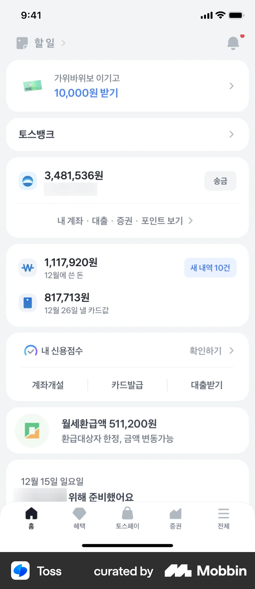
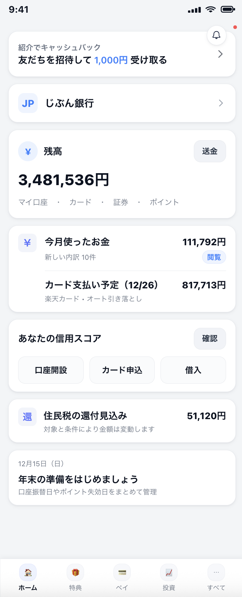
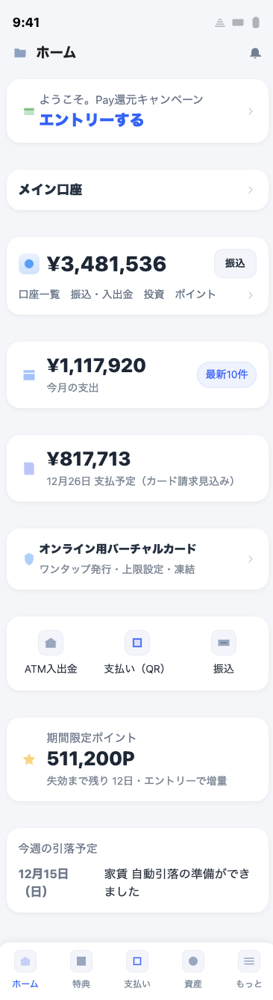

# Toss UI Mimicking

##  Attached Screenshot:

## First Try

### Used Prompt:
To launch this app in Japan, Create a prototype of the app screen with a main screen layout that will appeal to major users in Japan, using a UI style exactly same to a screenshot, and generate it as a single HTML file code.

### Result:

## Second Try

### Used Prompt:
Before creating the prototype, conduct thorough research into what Japanese fintech app users value most, including preferred features, trust and security expectations, design patterns, and content priorities in the Japanese market. Analyze the main screens of leading Japanese fintech apps to determine which features should be emphasized or re-ordered for maximum appeal and retention. Incorporate this business-driven localization into the app’s main screen layout, ensuring all cultural and functional adjustments align with Japanese user behavior. While applying these changes, maintain absolute pixel-level fidelity to the provided screenshot in terms of visual style, exact proportions, color codes, font families and weights, letter spacing, line heights, margins, paddings, corner radii, border widths, drop shadows, gradients, and iconography. Every element’s position, alignment, and size must match the original with no deviation beyond ±1px. The final deliverable must be a single fully self-contained HTML file with inline CSS and optional inline JavaScript, with no external libraries or frameworks, rendering identically across modern mobile browsers.

### Result:
